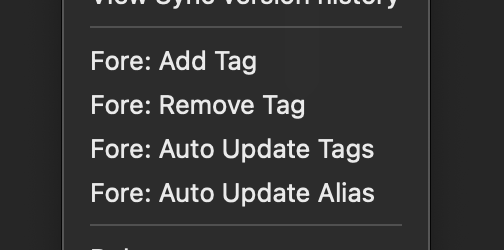
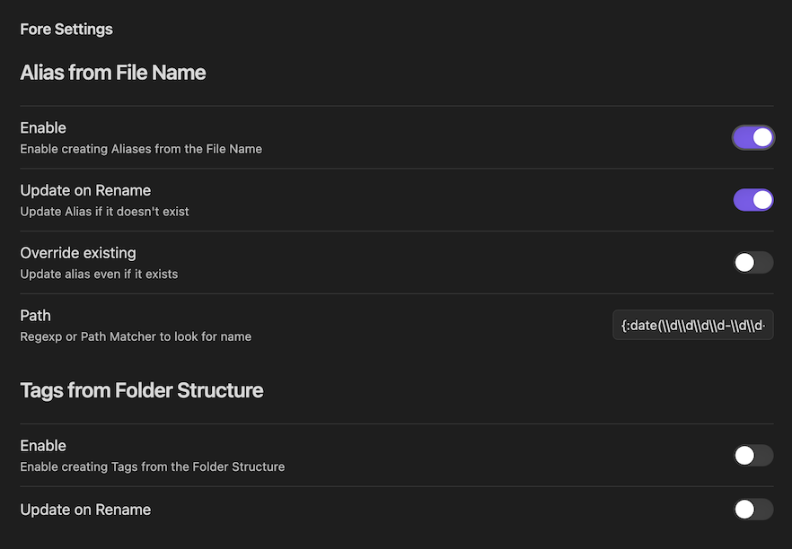

# Fore - Frontmatter Automation, an Obsidian Plugin

**Note:** This project is only intended for personal use and is not feature complete.

-   Add and Remove Tags for entire folders of files
-   Add Aliases and Tags with commands and hotkeys
-   Automate Aliases from file name conventions
-   Automate Tags from folder structure

This is a plugin for Obsidian (https://obsidian.md).



**Why "Fore"?** Fore, meaning "Located at or toward the front" is in reference to updating frontmatter. But it's also a nice short name to put in the context menu.



## How to Install

Currently this plugin is not published to Obsidian.

To trial it now install and use [BRAT], following the steps listed entering the below URL when prompted:

```
https://github.com/jahredhope/obsidian-fore-plugin
```

### Set Alias from Name

Automatically add a shorter alias to files based on your own common file name convention.

Describe your file naming convention using [parameterized path] or regular expression. The command will then look for the parameter "name" and add it to your alias.

[parameterized path]: https://www.npmjs.com/package/path-to-regexp

#### Example:

```
{:date(\\d\\d\\d\\d-\\d\\d-\\d\\d) - }?{:kind - }?{:name}{, :descriptor}?
```

**with Date and Kind**

```
"2020-03-39 - Meeting - Product Roadmap" => Alias: Product Roadmap
```

**with Kind and Descriptor**

```
E.g. "Tool - Skaffold, Kubernetes Deployment" => Alias: Skaffold"
```

### Set Tag from File Path

Automatically add tags in a document's frontmatter that matches the files path.

E.g. Tool/Skaffold.md => `#tool`

E.g. Person/Jimmy/Articles => `#Person/Jimmy`

## Development Workflow

Clone the project into a new folder in `/path/to/vault/.obsidian/plugins/`.

#### Install Dependencies

```
pnpm install
pnpm dev
```

#### Install [Hot Reload] via [BRAT]

In Obsidian install and enable the community plugin [Obsidian42 - BRAT][brat].

Once enabled use it to add the following Plugin URL: `https://github.com/pjeby/hot-reload`

[hot reload]: https://github.com/pjeby/hot-reload
[brat]: https://github.com/TfTHacker/obsidian42-brat
